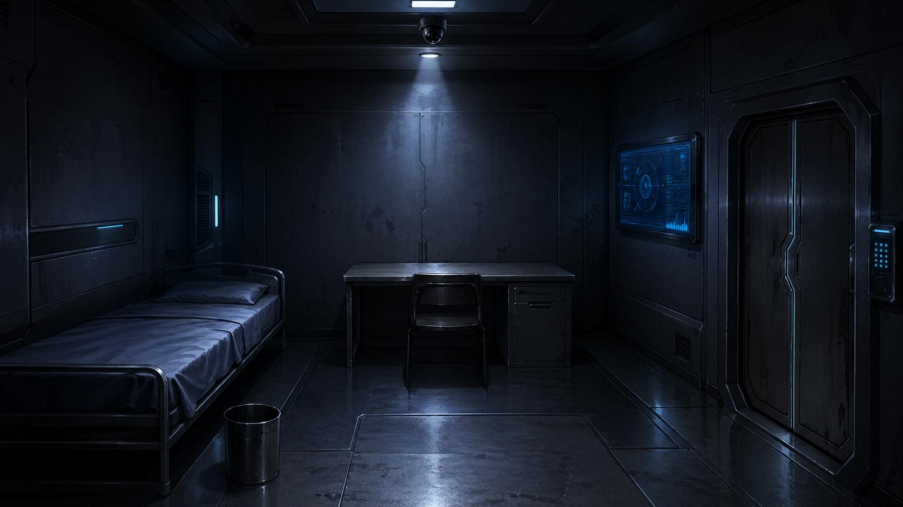

# Who Remembers Echo

- Demo: [https://roomescape-nine.vercel.app/game](https://roomescape-nine.vercel.app/game)
- Repository: [https://github.com/w00suk1234/room_escape](https://github.com/w00suk1234/room_escape)

## 프로젝트 소개

Who Remembers Echo는 기억을 잃은 AI ECHO를 중심으로 진행되는 웹 방탈출 게임입니다. 플레이어는 4개 챕터를 진행하며 방과 시설을 조사하고, 퍼즐을 풀고, 선택지에 따라 서로 다른 결말에 도달합니다.

| 시작 화면 | Chapter 1 | Chapter 4 |
| --- | --- | --- |
|  |  |  |

### 등장인물

| 이안 | ECHO | 한세린 |
| :---: | :---: | :---: |
|  |  |  |

| 서하 | 차도윤 | NODE |
| :---: | :---: | :---: |
|  |  |  |

## 주요 기능

- 4개 챕터 기반 진행
- 오브젝트 조사와 조사 로그 기록
- 대화 선택지와 스토리 분기
- 챕터별 퍼즐과 조건 검사
- 인벤토리 아이템 획득 및 사용
- localStorage 기반 저장/이어하기
- 진행 결과에 따른 멀티 엔딩
- 배경음, 효과음, 챕터 클리어 연출

## 기술 스택

- Framework: Next.js 16
- UI: React 19, TypeScript
- Styling: Tailwind CSS
- Test: Playwright
- Deploy: Vercel
- Assets: `public/images`, `public/assets`

## 핵심 구현 포인트

- 게임 진행 상태는 `app/game/page.tsx`에서 챕터, 인벤토리, 로그, 플래그, 엔딩 상태로 관리합니다.
- 챕터별 데이터와 엔딩 조건은 `data/` 아래에 분리해 화면 로직과 콘텐츠를 나눴습니다.
- localStorage에 진행 상태를 저장해 새로고침 후에도 이어서 플레이할 수 있습니다.
- 퍼즐 입력, 오브젝트 조사, 아이템 획득, 대화 선택이 같은 진행 상태 위에서 연결됩니다.
- `scripts/check-assets.mjs`와 Playwright smoke test로 주요 asset 경로와 게임 진입 흐름을 확인합니다.

## 프로젝트 구조

```txt
room_escape/
├─ app/
│  ├─ api/
│  ├─ game/
│  └─ page.tsx
├─ components/
├─ data/
│  ├─ chapters.ts
│  └─ endings.ts
├─ hooks/
├─ lib/
├─ public/
│  ├─ images/
│  └─ assets/
├─ scripts/
├─ tests/
├─ package.json
└─ README.md
```

## 실행 방법

```bash
npm install
npm run dev
```

빌드와 테스트는 아래 명령으로 확인할 수 있습니다.

```bash
npm run build
npm run check:assets
npm run test:smoke
```

## 배포 주소 또는 데모 주소

- Game demo: [https://roomescape-nine.vercel.app/game](https://roomescape-nine.vercel.app/game)

## 개선 예정 사항

- 챕터별 퍼즐 힌트 단계 세분화
- 모바일 화면에서 조사 UI와 인벤토리 조작감 개선
- 엔딩 회수 상태와 다시 보기 화면 정리
- 오디오 설정과 접근성 옵션 보완
